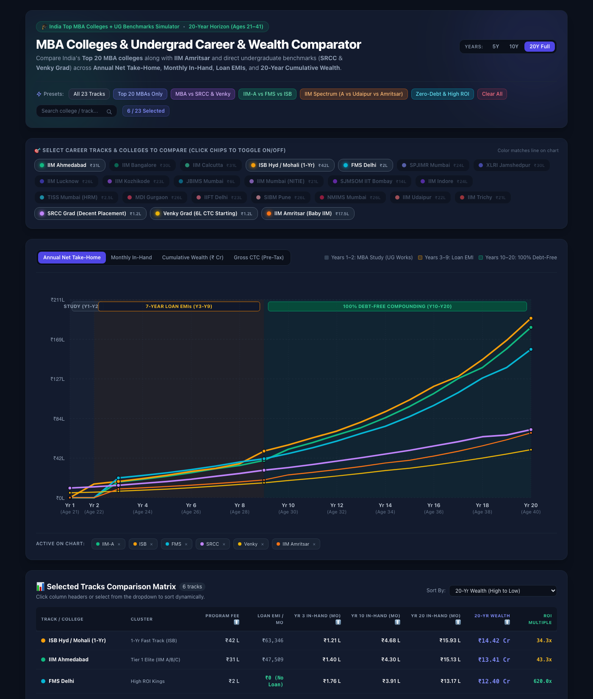
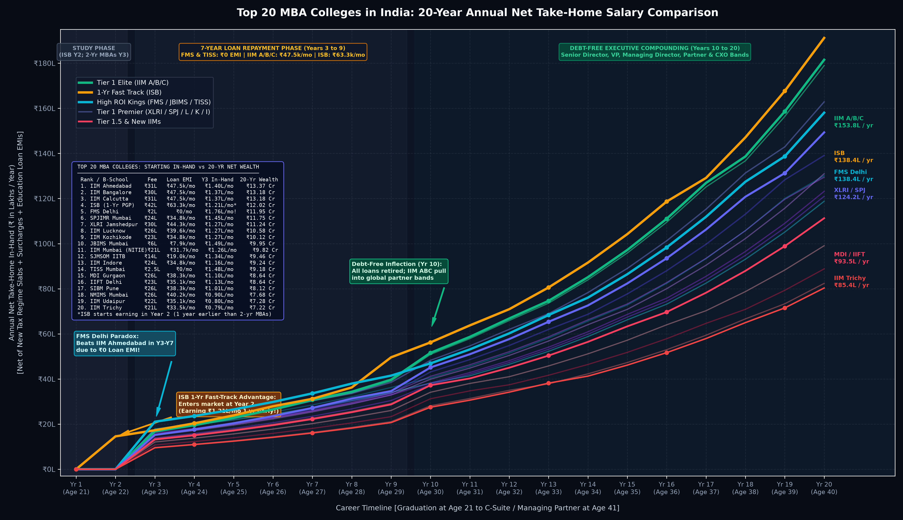
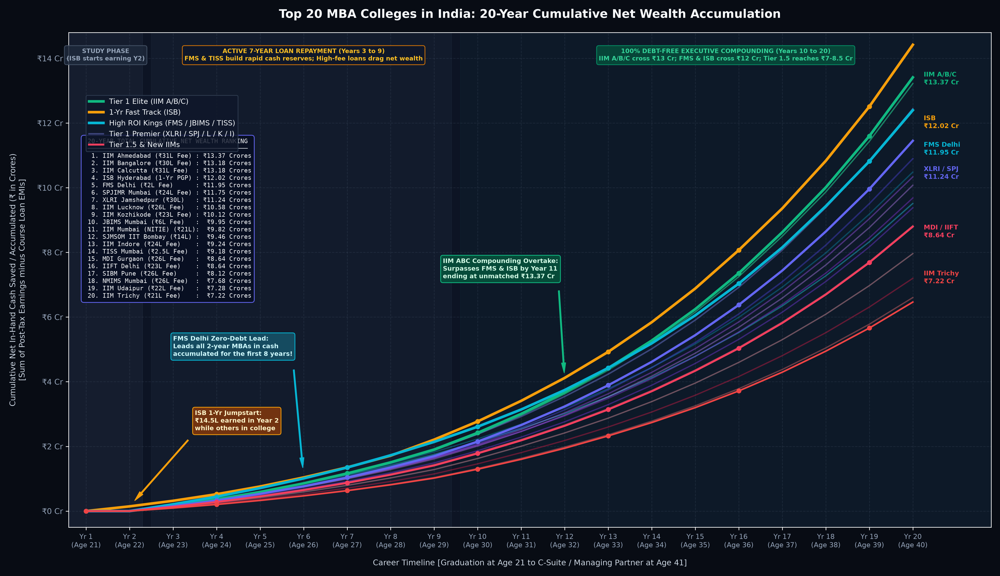

# 🎓 CareerTracker: India Top MBA & Undergrad 20-Year Compensation Simulator

[](https://manandewan.github.io/careertracker/)
[](https://python.org)
[](https://tailwindcss.com)

An interactive financial simulator and career trajectory comparator modeling **India's Top 20 MBA colleges**, **Baby IIMs (IIM Amritsar)**, and direct undergraduate corporate tracks (**SRCC** and **Venky Grad**) across a **20-year career horizon** (Ages 21 to 41, from graduation to C-Suite / Managing Partner).

Unlike naive CTC comparisons, **CareerTracker** computes actual in-hand disposable salary and long-term liquid wealth after strictly deducting:
1. **Course Tuition & Living Expenses** (₹1.2 Lakhs to ₹42.0 Lakhs).
2. **Education Loan EMIs** over a 7-year repayment tenure (8.5%–9.0% interest post-moratorium).
3. **Indian Income Tax (New Tax Regime 2024–2026)** including standard deductions (₹75,000), marginal tax brackets, 4% health & education cess, and high-income surcharges (up to 25% for >₹2 Crores).
4. **CTC Inflation & Cash Realization** (80% fixed cash vs 20% retirals/performance variable).

---

## 🚀 Live Interactive Dashboard

The interactive web dashboard is 100% self-contained in `index.html` and ready for GitHub Pages:

👉 **Live Demo**: [https://manandewan.github.io/careertracker/](https://manandewan.github.io/careertracker/) *(Enable GitHub Pages in repo settings)*



### Dashboard Features
- **Multi-Select Track Selector**: Filter and compare any combination of the 23 career tracks.
- **Smart Presets**:
  - `Top 20 MBAs Only`
  - `MBA vs SRCC & Venky`
  - `IIM-A vs FMS vs ISB` (The Holy Trinity Debate)
  - `IIM Spectrum` (Tier 1 Elite vs New IIMs vs Baby IIMs)
  - `Zero-Debt & High ROI` (FMS, JBIMS, TISS, SRCC)
- **Live SVG Chart**: Dynamic auto-scaling Y-axis, phase background bands, synchronized hover crosshair, and tooltips.
- **4 Metric Modes**: Annual Net Take-Home, Monthly In-Hand, Cumulative Wealth (₹ Cr), and Gross CTC.
- **Interactive Matrix Table**: Sortable by Program Fee, Monthly Loan EMI, Starting Take-Home, Debt-Free Salary, 20-Yr Wealth, and ROI Multiple.

---

## 📊 Comprehensive 20-Year Institutional Benchmark

| Rank / Track | Category | Program Fee | 7-Yr Loan EMI | Yr 1 In-Hand (Mo) | Yr 3 In-Hand (Mo) | Yr 10 In-Hand (Mo) | Yr 20 In-Hand (Mo) | 20-Yr Net Wealth |
| :--- | :--- | :---: | :---: | :---: | :---: | :---: | :---: | :---: |
| **ISB Hyd / Mohali** | 1-Yr Fast Track | ₹42.0 L | ₹63,346 / mo | ₹0 (Study) | ₹1.21 L / mo* | ₹4.68 L / mo | ₹15.93 L / mo | **₹14.42 Crores** |
| **IIM Ahmedabad** | Tier 1 Elite | ₹31.0 L | ₹47,509 / mo | ₹0 (Study) | ₹1.40 L / mo | ₹4.30 L / mo | ₹15.13 L / mo | **₹13.41 Crores** |
| **IIM Bangalore** | Tier 1 Elite | ₹30.0 L | ₹47,509 / mo | ₹0 (Study) | ₹1.37 L / mo | ₹4.24 L / mo | ₹14.91 L / mo | **₹13.22 Crores** |
| **IIM Calcutta** | Tier 1 Elite | ₹31.0 L | ₹47,509 / mo | ₹0 (Study) | ₹1.37 L / mo | ₹4.24 L / mo | ₹14.91 L / mo | **₹13.22 Crores** |
| **SPJIMR Mumbai** | Tier 1 Premier | ₹24.0 L | ₹34,840 / mo | ₹0 (Study) | ₹1.45 L / mo | ₹4.02 L / mo | ₹13.57 L / mo | **₹12.44 Crores** |
| **FMS Delhi** | High ROI King | ₹2.0 L | **₹0 / mo** | ₹0 (Study) | **₹1.76 L / mo!** | ₹3.91 L / mo | ₹13.17 L / mo | **₹12.40 Crores** |
| **XLRI Jamshedpur** | Tier 1 Premier | ₹30.0 L | ₹44,342 / mo | ₹0 (Study) | ₹1.27 L / mo | ₹3.76 L / mo | ₹12.44 L / mo | **₹11.45 Crores** |
| **IIM Lucknow** | Tier 1 Premier | ₹26.0 L | ₹39,591 / mo | ₹0 (Study) | ₹1.27 L / mo | ₹3.59 L / mo | ₹11.59 L / mo | **₹10.90 Crores** |
| **JBIMS Mumbai** | High ROI King | ₹6.0 L | ₹7,918 / mo | ₹0 (Study) | **₹1.49 L / mo** | ₹3.38 L / mo | ₹10.84 L / mo | **₹10.49 Crores** |
| **IIM Kozhikode** | Tier 1 Premier | ₹23.0 L | ₹34,840 / mo | ₹0 (Study) | ₹1.27 L / mo | ₹3.43 L / mo | ₹10.79 L / mo | **₹10.34 Crores** |
| **IIM Mumbai (NITIE)** | Tier 1 Premier | ₹21.0 L | ₹31,673 / mo | ₹0 (Study) | ₹1.26 L / mo | ₹3.32 L / mo | ₹10.92 L / mo | **₹10.08 Crores** |
| **SJMSOM IIT Bombay** | High ROI | ₹14.0 L | ₹19,004 / mo | ₹0 (Study) | ₹1.34 L / mo | ₹3.19 L / mo | ₹10.27 L / mo | **₹9.68 Crores** |
| **IIM Indore** | Tier 1 Premier | ₹24.0 L | ₹34,840 / mo | ₹0 (Study) | ₹1.16 L / mo | ₹3.13 L / mo | ₹10.08 L / mo | **₹9.38 Crores** |
| **TISS Mumbai (HRM)** | High ROI | ₹2.5 L | **₹0 / mo** | ₹0 (Study) | **₹1.48 L / mo** | ₹3.18 L / mo | ₹9.90 L / mo | **₹9.52 Crores** |
| **MDI Gurgaon** | Tier 1.5 Established | ₹26.0 L | ₹38,310 / mo | ₹0 (Study) | ₹1.10 L / mo | ₹3.10 L / mo | ₹9.27 L / mo | **₹8.80 Crores** |
| **IIFT Delhi** | Tier 1.5 Established | ₹23.0 L | ₹35,117 / mo | ₹0 (Study) | ₹1.13 L / mo | ₹3.10 L / mo | ₹9.27 L / mo | **₹8.83 Crores** |
| **SIBM Pune** | Tier 1.5 Private | ₹26.0 L | ₹38,310 / mo | ₹0 (Study) | ₹1.01 L / mo | ₹2.84 L / mo | ₹8.26 L / mo | **₹7.96 Crores** |
| **SRCC Grad** | Direct Undergrad | **₹1.2 L** | **₹0 / mo** | **₹0.86 L / mo** | **₹1.10 L / mo** | **₹2.67 L / mo** | **₹6.04 L / mo** | **₹7.30 Crores** |
| **NMIMS Mumbai** | Tier 1.5 High-Fee | ₹26.0 L | ₹40,223 / mo | ₹0 (Study) | ₹0.90 L / mo | ₹2.60 L / mo | ₹7.40 L / mo | **₹7.20 Crores** |
| **IIM Udaipur** | Top New IIM | ₹22.0 L | ₹35,117 / mo | ₹0 (Study) | ₹0.80 L / mo | ₹2.35 L / mo | ₹6.87 L / mo | **₹6.60 Crores** |
| **IIM Trichy** | Top New IIM | ₹21.0 L | ₹33,521 / mo | ₹0 (Study) | ₹0.79 L / mo | ₹2.29 L / mo | ₹6.70 L / mo | **₹6.46 Crores** |
| **IIM Amritsar** | Baby IIM (Tier 2) | ₹17.5 L | ₹25,540 / mo | ₹0 (Study) | **₹0.77 L / mo** | **₹2.02 L / mo** | **₹5.89 L / mo** | **₹5.67 Crores** |
| **Venky Grad** | Direct Undergrad | **₹1.2 L** | **₹0 / mo** | **₹0.43 L / mo** | **₹0.58 L / mo** | **₹1.52 L / mo** | **₹4.26 L / mo** | **₹4.49 Crores** |

*\*Note: ISB alumni enter the workforce in Year 2 (Age 22), 1 full year earlier than 2-year MBA peers.*

---

## 📈 Visual Graphs

### Annual Net Take-Home Comparison


### 20-Year Cumulative Wealth Accumulation


---

## 💡 Key Strategic Takeaways & Institutional Paradoxes

### 1. The FMS & JBIMS "Zero-Debt" Superpower
With program fees under ₹6 Lakhs, graduates take on zero or nominal loans. In Years 3 to 9, an FMS graduate takes home **₹1.76 Lakhs/month**, while an IIM Ahmedabad graduate takes home **₹1.40 Lakhs/month** (due to IIM-A's ₹47,509/mo EMI). FMS alumni lead all 2-year MBAs in accumulated net cash until Year 8 of their careers.

### 2. The SRCC Undergrad Paradox (Beating New & Baby IIMs)
An SRCC graduate entering corporate roles immediately at Year 1 accumulates **₹7.30 Crores** over 20 years. This **surpasses New IIMs** (IIM Udaipur ₹6.60 Cr, IIM Trichy ₹6.46 Cr) and **beats Baby IIMs** (IIM Amritsar ₹5.67 Cr) because the graduate incurs ₹0 in tuition loans and avoids 2 years of lost earnings opportunity cost.

### 3. The Baby IIM Squeeze (IIM Amritsar)
Taking a ₹16.0 Lakhs loan against a ₹16.5 LPA starting CTC creates a heavy **₹25,540/month EMI burden**, suppressing Year 3 take-home to **₹77,000/month**. Over 20 years, it finishes at **₹5.67 Crores**, illustrating why Tier-2/Baby IIMs require careful ROI scrutiny.

### 4. The ISB 1-Year Fast-Track Multiplier
Graduating in 1 year allows ISB alumni to start drawing full salary in **Year 2 (Age 22)**, saving **₹14.5 Lakhs** while 2-year peers are still in campus dorms. Despite a ₹42L fee and ₹63.3k/mo EMI, this 1-year early lead keeps ISB ahead in cumulative net worth until Year 11.

### 5. The IIM ABC Executive Compounding Ceiling
While low-fee and 1-year programs lead early, **IIM Ahmedabad, Bangalore, and Calcutta** dominate terminal compensation. Superior pipeline access to MBB Partner tracks and bulge-bracket Private Equity / Investment Banking carries drives a sustained **16.5% CAGR**, culminating in an unbeatable **₹13.4+ Crores** in terminal wealth.

---

## 📁 Repository Structure

```
careertracker/
├── index.html                           # Full interactive comparator dashboard (GitHub Pages)
├── README.md                            # Documentation & institutional analysis
├── .gitignore                           # Standard git ignore
├── assets/
│   └── images/                          # High-resolution simulation plots & previews
│       ├── top20_mba_annual_salary_graph.png
│       ├── top20_mba_wealth_graph.png
│       ├── comparator_ug_preview.png
│       ├── annual_net_take_home_graph.png
│       └── cumulative_wealth_accumulation_graph.png
├── data/
│   └── career_tracks_dataset.json       # Precomputed 20-year series for all 23 tracks
└── scripts/
    └── simulate_career_tracks.py        # Python simulation engine & tax/EMI model
```

---

## 🛠️ How to Enable GitHub Pages
1. Go to your repository on GitHub: `https://github.com/manandewan/careertracker`
2. Navigate to **Settings** > **Pages**.
3. Under **Build and deployment** > **Source**, select **Deploy from a branch**.
4. Set branch to `main` and folder to `/ (root)`.
5. Click **Save**. Within 60 seconds, your interactive dashboard will be live at `https://manandewan.github.io/careertracker/`!
